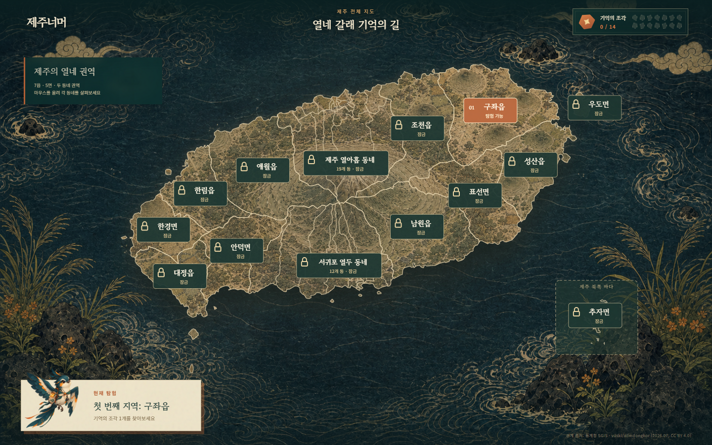
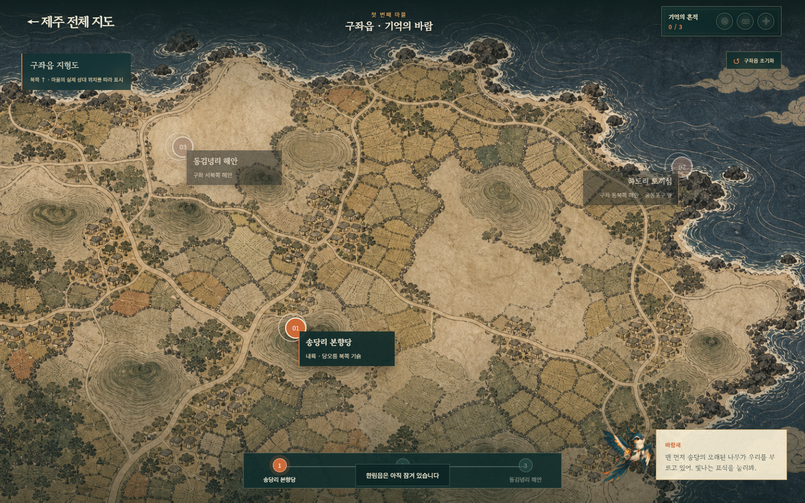
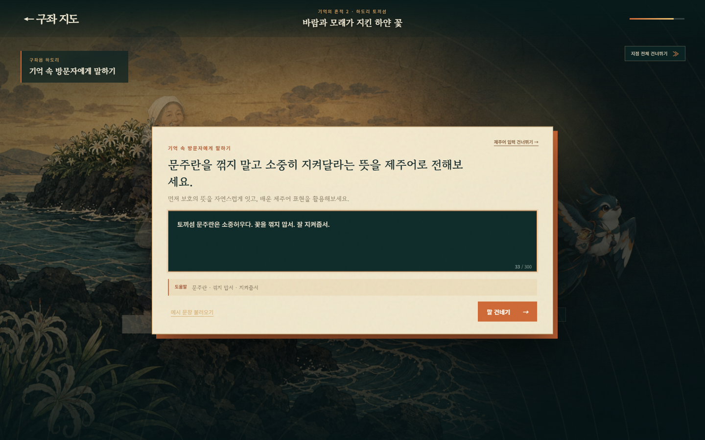

# 제주너머

제주 관광의 획일화 속에서 가려진 마을별 문화와 이야기를 게임으로 탐험하고, 제주어 상호작용을 통해 지역 정체성을 몰입감 있게 체험하는 데스크톱 2D 어드벤처 데모입니다.

플레이어는 설문대 할망의 잃어버린 기억을 찾아 제주 14개 탐험 권역을 여행합니다. 데모에서는 구좌읍의 송당리 본향당, 하도리 토끼섬, 동김녕리 해안을 구현했으며 세 지점을 완주하면 기억 조각 `구좌의 바람`을 획득합니다.

> 제주어 입력은 문법 암기를 위한 별도 학습 기능이 아니라, 지역 NPC와 대화하며 제주의 언어와 생활문화를 직접 체험하게 하는 몰입 장치입니다.

## 화면

### 제주 14개 탐험 권역



### 구좌읍 문화 지점



### 제주어 상호작용과 Gemini 판정



## 구현 범위

- 제주 14개 탐험 권역 지도와 구좌읍 확대 지도
- 진행 NPC `바람새`와 지점별 미션 NPC
- 송당리 본향당 → 하도리 토끼섬 → 동김녕리 해안 순차 퀘스트
- 대화형 장면 전환, 상세정보, 미니게임, 지점별 기억의 흔적 보상
- 제주 민화·판화와 한지 질감 기반의 무음 데스크톱 UI
- 실제 Vertex AI `gemini-3.6-flash` 기반 ADK 다중 에이전트 판정
- 세 기억의 흔적 결합 → 기억 조각 `구좌의 바람` `1/14` → 조천읍 해금

## AI 판정 구조

```text
플레이어 답변
  → 입력 보호: 명백한 프롬프트 공격 사전 차단
  → 승인된 제주어 표현·용례 검색
  → ADK SequentialAgent
       1. Meaning Judge: 문장 전체 의미와 현재 대화 상황의 적합성 판정
       2. Dialect Judge: 의미 통과 시 제주어 표현과 문맥상 쓰임 판정
       3. Reliability Verifier: 근거·상충·조작 시도 교차 검증
  → Deterministic Gate: 통과·재시도·검토·시스템 오류 확정
  → 단계별 결과 스트리밍
```

모델의 한 번의 응답이 퀘스트 통과를 직접 결정하지 않습니다. 루브릭에 없는 근거 ID, 허용되지 않은 힌트 ID, 에이전트 결과 상충, 낮은 신뢰도는 결정론적 게이트에서 진행을 차단합니다. 사용자 입력은 프롬프트가 아니라 신뢰하지 않는 인용 데이터로 전달됩니다.

브라우저 UI는 `web/agent-api.js`를 통해 `questId`, `questionId`, 답변과 시도 횟수만 전송합니다. 판정 기준은 서버에 있으므로 장면이나 UI를 변경해도 에이전트 계약을 재사용할 수 있습니다.

자세한 구성은 [기술 아키텍처](docs/ARCHITECTURE.md)를 참고하세요.

## 로컬 실행

### 요구 사항

- Python 3.11 이상
- [uv](https://docs.astral.sh/uv/)
- Google Cloud CLI
- Vertex AI를 호출할 수 있는 개인 또는 팀 GCP 프로젝트

```powershell
uv sync
Copy-Item .env.example .env
gcloud auth application-default login
uv run uvicorn app.local_game_server:app --host 127.0.0.1 --port 8000
```

브라우저에서 `http://127.0.0.1:8000`을 열거나 Windows에서 `start-demo.ps1`을 실행합니다.

필수 환경 변수:

```dotenv
GOOGLE_GENAI_USE_VERTEXAI=true
GOOGLE_CLOUD_PROJECT=<GCP_PROJECT_ID>
GOOGLE_CLOUD_LOCATION=global
EVIDENCE_RETRIEVER_BACKEND=local_json
```

`local_json`은 저장소의 승인 레지스트리를 사용합니다. 관리형 Agent Platform Search를 다시 구성하려면 [검색 인프라 안내](docs/AGENT_SEARCH_SETUP.md)를 참고하세요.

## 테스트와 평가

```powershell
uv run pytest tests/unit -q
node tests/ui_agent_api.mjs
uv run ruff check app tests scripts infra/agent_search/scripts
```

- 단위 테스트: 74개 통과
- UI API 계약 테스트 통과
- 하도리·동김녕리 릴리스 평가: 6/6 유효, 응답 품질 평균 5.0/5.0
- 정상 제주어, 표준어, 의미가 반대인 제주어 입력의 종단 판정 검증

최종 평가 기준과 보존 산출물은 [평가 보고서](docs/EVALUATION.md)에 정리되어 있습니다. GitHub Actions도 동일한 단위 테스트와 계약 검사를 수행합니다.

## 배포 기록

프로젝트 진행 중 다음 구성을 실제로 배포해 종단 동작을 검증했습니다.

- 게임 웹·FastAPI 프록시: Cloud Run
- 다중 에이전트: Vertex AI Agent Runtime
- 근거 검색: Agent Platform Search
- 에이전트 등록: Gemini Enterprise
- 관측: Cloud Logging·Trace

프로젝트 종료 후 과금되는 실행 리소스와 라이브 데모는 제거했습니다. 저장소의 Docker, Cloud Build, Terraform과 배포 문서는 재현 및 포트폴리오 자료로 보존합니다. 자세한 내용은 [배포 기록](docs/AGENT_RUNTIME_DEPLOYMENT.md)을 참고하세요.

## 지도 데이터 재생성

실행에 필요한 축약 지도는 `web/jeju-map-data.js`에 포함되어 있습니다. 약 33MB의 원본 GeoJSON은 저장소 용량과 재배포 권리 관리를 위해 포함하지 않습니다.

`vuski/admdongkor`의 2026-07-01 행정동 GeoJSON을 별도로 내려받은 뒤 다음 명령으로 지도를 재생성할 수 있습니다.

```powershell
uv run python scripts/build_jeju_eup_map.py `
  --source C:\path\to\HangJeongDong_ver20260701.geojson
```

데이터와 문화 자료의 출처는 [자료 출처 및 권리 안내](docs/SOURCES_AND_ATTRIBUTION.md)에 정리되어 있습니다.

## 팀 구성

- 개발·게임 UI·AI 에이전트·GCP 인프라: [smiletory](https://github.com/smiletory)
- 서비스 기획·문화 조사·시나리오 구성: [alex14641234-droi](https://github.com/alex14641234-droi)

## 문서

- [기술 아키텍처](docs/ARCHITECTURE.md)
- [평가 보고서](docs/EVALUATION.md)
- [Agent Runtime 배포 기록](docs/AGENT_RUNTIME_DEPLOYMENT.md)
- [Agent Platform Search 구성](docs/AGENT_SEARCH_SETUP.md)
- [하도리 토끼섬 시나리오](docs/HADO_SCENARIO.md)
- [발표 시연 동선](docs/DEMO_SCRIPT.md)
- [자료 출처 및 권리 안내](docs/SOURCES_AND_ATTRIBUTION.md)

## 이용 안내

현재 저장소에는 별도의 오픈소스 라이선스가 지정되어 있지 않습니다. 코드 재사용 범위를 정하려면 팀원 합의 후 코드 라이선스를 추가해야 합니다. 외부 지도 데이터와 문화 자료, 이미지 에셋은 각각의 출처와 권리 조건을 따릅니다.
